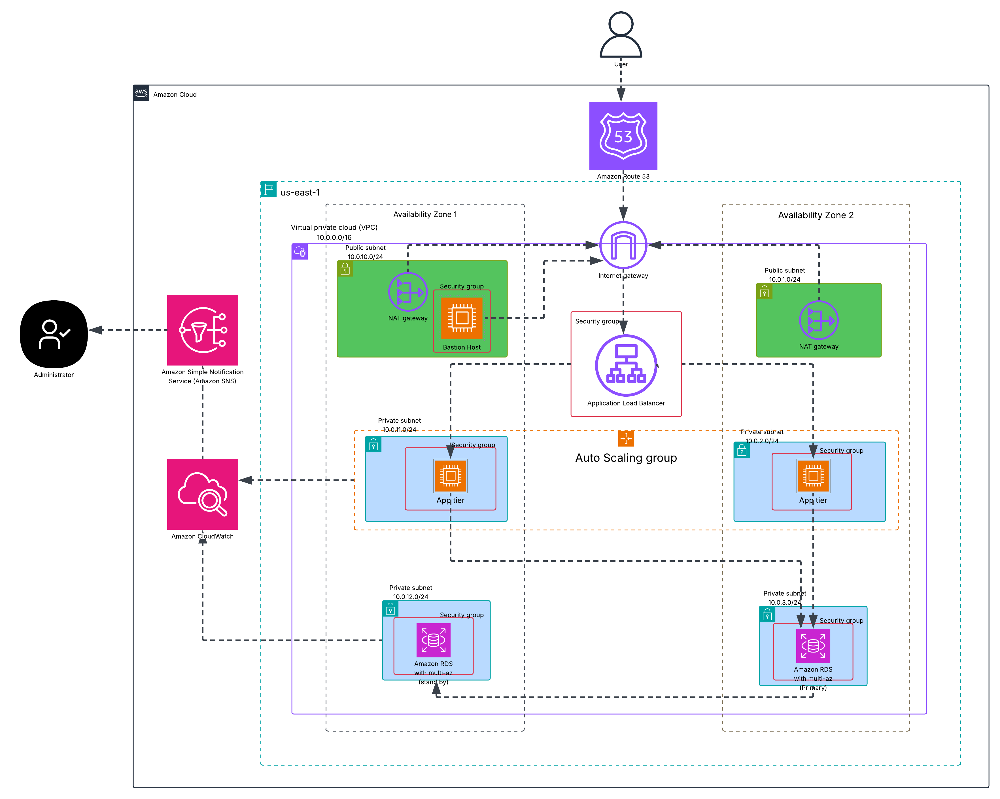

# 🚀 Scalable 2-Tier Web Application on AWS

This project demonstrates how to deploy a highly available and scalable 2-tier web application on AWS using core services like EC2, ALB, ASG, and RDS.

## 📌 Architecture Overview

## 🔧 Key AWS Services Used
<!-- We'll fill this next -->

## 🔐 IAM Roles and Security
<!-- We'll fill this next -->

## 🛠️ Project Workflow
<!-- We'll fill this next -->

## 📬 Monitoring & Alerts
<!-- We'll fill this next -->

## 📁 Folder Structure
<!-- We'll fill this next -->

## 🧪 How to Deploy
<!-- Optional: Terraform or scripts guide -->

## 📝 Notes
<!-- Any extra observations -->
